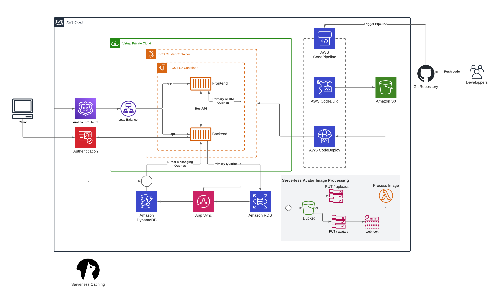
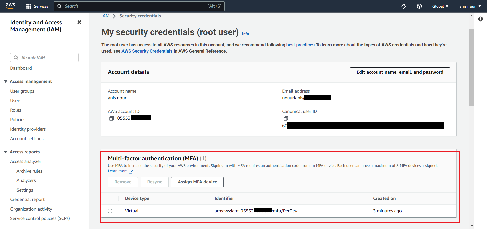
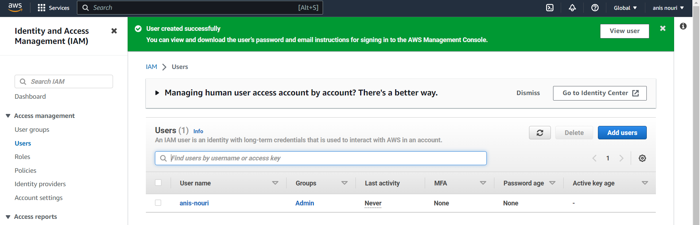
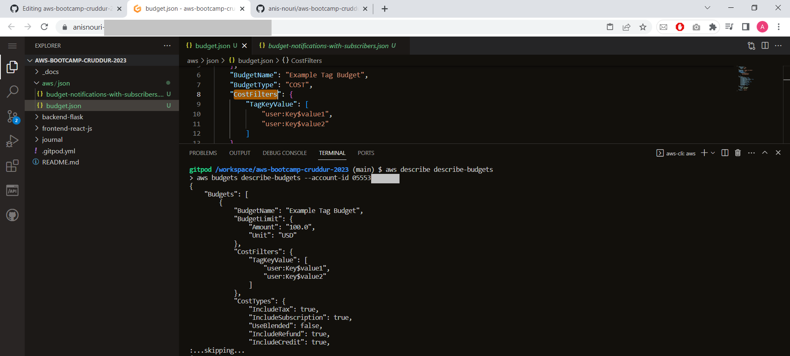
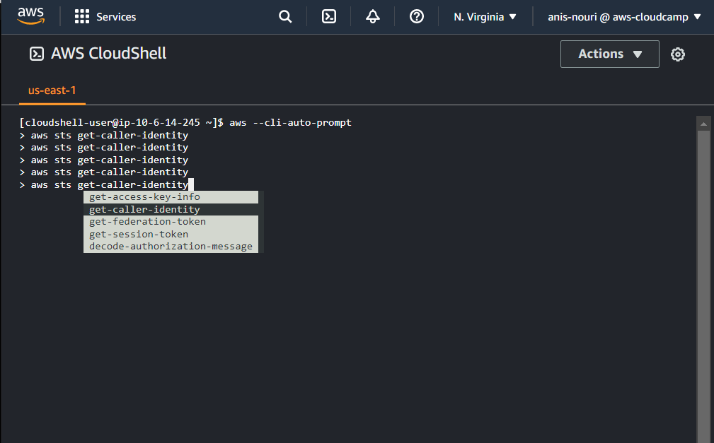
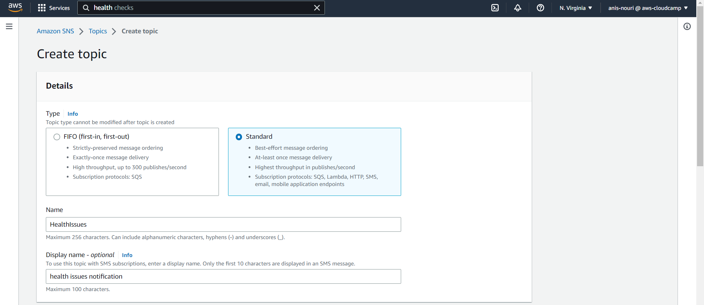
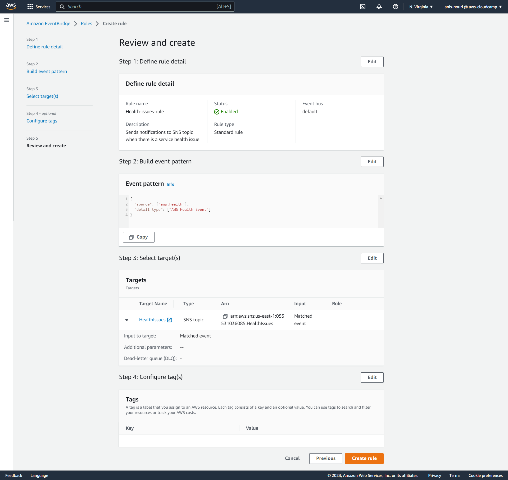
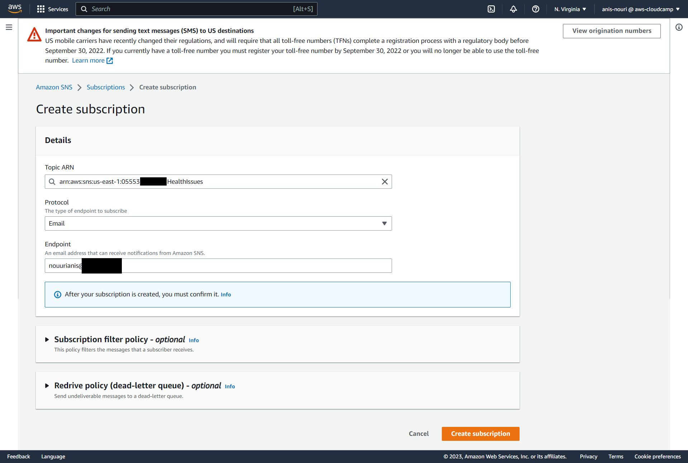

# Week 0 — Billing and Architecture

## Required Homework

### Conceptual Diagram in Lucid Charts or on a Napkin

### Logical Architectual Diagram in Lucid Charts



I added a CI/CD pipeline in the digram using these services:
* **AWS CodePipeline**: To create the pipeline.
* **S3 bucket**: For artifact storage. 
* **AWS CodeBuild**: To build the application code and generate the artifacts, then output the genereted artifacts to the S3 bucket.
* **AWS CodeDeploy**: To deploy the artifacts to the target environment, in this case ECS clusters.

here is the [lucidchart link](https://lucid.app/lucidchart/a40d3982-f035-471c-bede-2b6694b84140/edit?viewport_loc=-267%2C-56%2C3623%2C1848%2C0_0&invitationId=inv_ed90e67a-ae8b-4761-8bcf-7e635c2c714e) for my digram.

### Setting up The Root account and Admin user
The root account is the most privileged account with all the access, hence protecting it is a necessity.
It is strongly recommend that we do not use the root user account for everyday tasks, even the administrative ones. Root user credentials are only used to perform a few account and service management tasks.
In order to protect my root user account I did the following:
#### Enable MFA:
AWS multi-factor authentication (MFA) is an AWS Identity and Access Management (IAM) best practice that requires a second authentication factor in addition to user name and password sign-in credentials.  

Steps followed:  
1. Log in to the AWS Management Console using your root account credentials.
2. Go to "My Security Credentials" page and select "Activate MFA."
3. :Choose the type of MFA device you want to use.
4. :Follow the setup instructions for the MFA device type you selected.



#### Create Admin User:
IAM (Identity and Access Management) admin user is a type of user in AWS that has full administrative access to the AWS Management Console and all AWS services and resources.

1. Log in to the **AWS Management Console** using your root account credentials.
2. Go to the **IAM dashboard** and click on **Users**.
3. Click on **Add User** and enter a name for the new user.
4. click on **Provide user access to the AWS Management Console**.
5. Set a password or have AWS generate one for you.
6. Add the user to the "Administrators" group or attach the "AdministratorAccess" policy.
7. Review and click on "Create User."



Enable MFA for the admin user created, to ensure the security of your AWS resources.


### Create a Billing Alarm


### Create Budgets
I set up a two cost budgets in the AWS Billing Console using **AWS Budgets**.
One to track my dollar spending , and the other one for tracking my credits spending.

 

#### Using AWS CLI to create a bugdet:
To create a budget using AWS CLI I used the example from the [AWS CLI Command Reference - AWS Documentation](https://docs.aws.amazon.com/cli/latest/reference/budgets/create-budget.html).  
* Set an environment variable named **AWS_ACCOUNT_ID**, export it to the global environment:
```
export AWS_ACCOUNT_ID=$(aws sts get-caller-identity --query Account --output text)
```
* Create the json files "budget-notifications-with-subscribers.json" and "budget.json" both ound on the refrenced link.
* Create the budget: To create a budget in AWS, you will need to run the create-budget command using the AWS CLI.
```
aws budgets create-budget \
    --account-id $AWS_ACCOUNT_ID \
    --budget file://aws/json/budget.json \
    --notifications-with-subscribers file://aws/json/budget-notifications-with-subscribers.json
```
* Run the following command to list all budgets in your AWS account:
```
aws budgets describe-budgets --account-id
```


 
### Use CloudShell
AWS CloudShell is a browser-based shell, you can quickly run scripts with the AWS Command Line Interface (CLI), experiment with service APIs using the AWS CLI, and use other tools to increase your productivity. The CloudShell icon appears in AWS Regions where CloudShell is available.

The AWS Command Line Interface (AWS CLI) includes a bash-compatible command-completion feature that enables you to use the Tab key to complete a partially entered command, thus improving your productivity.

To configure auto-prompt I used this command in the CloudShell:
```
aws --cli-auto-prompt
```



### Install AWS CLI

## Homework Challenges
### Use EventBridge to hookup Health Dashboard to SNS and send notification when there is a service health issue:
#### Description
AWS Health generates an event when there is a service health issue. The event contains information about the affected AWS services, the region in which the issue occurred, and the status of the issue. When this event is sent to EventBridge, it can be used to trigger actions in our case sending notifications to an SNS topic.

To set this up we need to do the following steps:

1. Create an SNS Topic:



2. Create an EventBridge Rule:



3. Subscribe to the SNS Topic:



That's it! Now, when there is a service health issue, EventBridge will send a notification to the SNS topic created, and the subscribers to the topic will receive the notification via email.

Here are some helpful AWS documentation sources:
[Creating an Amazon SNS topic](https://docs.aws.amazon.com/sns/latest/dg/sns-tutorial-create-topic.html) 
[Creating an Amazon EventBridge rule](https://docs.aws.amazon.com/eventbridge/latest/userguide/create-eventbridge-rule.html)
[Subscribing to an Amazon SNS topic](https://docs.aws.amazon.com/sns/latest/dg/SubscribeTopic.html) 

