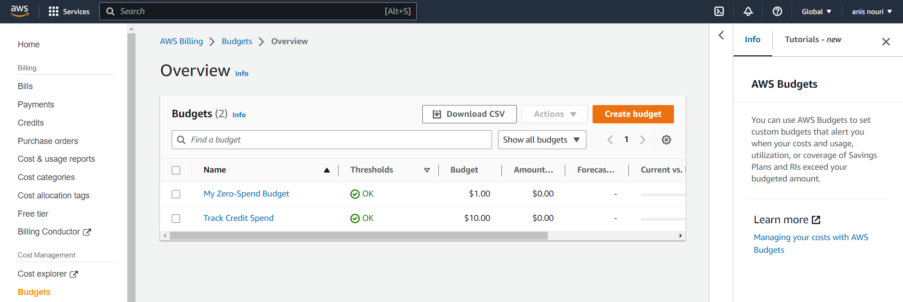

# Week 0 — Billing and Architecture

## Required Homework

### Conceptual Diagram in Lucid Charts or on a Napkin

### Logical Architectual Diagram in Lucid Charts

### Setting up The Root account and Admin user
The root account is the most privileged account with all the access, hence protecting it is a necessity.
It is strongly recommend that we do not use the root user account for everyday tasks, even the administrative ones. Root user credentials are only used to perform a few account and service management tasks.
In order to protect my root user account I did the following:
#### Enable MFA:
AWS multi-factor authentication (MFA) is an AWS Identity and Access Management (IAM) best practice that requires a second authentication factor in addition to user name and password sign-in credentials.

**insert image**

#### Create Admin User:


### Create a Billing Alarm


### Create Budgets
I set up a two cost budgets in the AWS Billing Console using **AWS Budgets**.
One to track my dollar spending , and the other one for tracking my credits spending.

 


 
### Use CloudShell
AWS CloudShell is a browser-based shell, you can quickly run scripts with the AWS Command Line Interface (CLI), experiment with service APIs using the AWS CLI, and use other tools to increase your productivity. The CloudShell icon appears in AWS Regions where CloudShell is available.

The AWS Command Line Interface (AWS CLI) includes a bash-compatible command-completion feature that enables you to use the Tab key to complete a partially entered command, thus improving your productivity.

To configure auto-prompt I used this command in the CloudShell:
```
aws --cli-auto-prompt
```

**insert image**

### Install AWS CLI

## Homework Challenges

