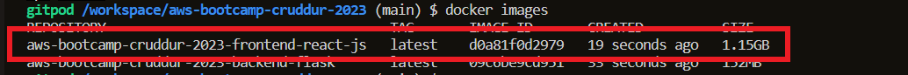

# App Containerization:
Anna, a software developer, just finished developing a new application that she believes it's ready for production. She hands the program files over to the operations team for deployment on the production servers.

However, when the operations team attempts to launch the application on the production servers, it doesn't seem to work. After troubleshooting, the ops team realizes that the application was developed and tested on Anna's personal computer, which has a different environment and configurations than the production servers.

The operations team reaches out to Anna, who initially responds with frustration, saying *It works on my computer!* But after realizing the issue, Anna works with the operations team to identify the discrepancies between her development environment and the production environment. Together, they make the necessary adjustments to the application's configuration and dependencies to ensure it runs properly in the production environment.


That's when app containerization comes to use.  
During this week, I learned about app containerization and its benefits. I learned how to create, manage, and deploy a containerized applications using Docker.


## What is app containerization :
Application containerization is the process of packaging an application and its dependencies into a single container image that can run consistently across different computing environments, making application deployment faster, more reliable, and more efficient.

## Containerize Backend and Frontend:
### Containerize Backend:
#### Create a Dockerfile:
```
FROM python:3.10-slim-buster

WORKDIR /backend-flask

COPY requirements.txt requirements.txt
RUN pip3 install -r requirements.txt

COPY . .

ENV FLASK_ENV=development

EXPOSE ${PORT}
CMD [ "python3", "-m" , "flask", "run", "--host=0.0.0.0", "--port=4567"]

```
#### Build container:
```
docker build -t  backend-flask ./backend-flask
```

#### Run container:
```
docker run --rm -p 4567:4567 -it  -e FRONTEND_URL -e BACKEND_URL backend-flask
```
### Containerize Frontend:
#### Create a Dockerfile:
```
FROM node:16.18

ENV PORT=3000

COPY . /frontend-react-js
WORKDIR /frontend-react-js
RUN npm install
EXPOSE ${PORT}
CMD ["npm", "start"]
```
#### Build Container:
```
docker build -t frontend-react-js ./frontend-react-js

```
#### Run Container:
```
docker run -p 3000:3000 -d frontend-react-js
```

### Checking docker Containers and Images:
#### Show the list of locally available images:
```
docker images
```


#### Show the list of running containers:
```
docker ps
```


### Containerize DynamoDB Local and PostgreSQL:
#### Postgres
```
services:
  db:
    image: postgres:13-alpine
    restart: always
    environment:
      - POSTGRES_USER=postgres
      - POSTGRES_PASSWORD=password
    ports:
      - '5432:5432'
    volumes: 
      - db:/var/lib/postgresql/data
volumes:
  db:
    driver: local
```
#### Testing connection :
* Use the Used the *Database explorer* installed in VSC


* Install the postgres client into Gitpod
```
 - name: postgres
    init: |
      curl -fsSL https://www.postgresql.org/media/keys/ACCC4CF8.asc|sudo gpg --dearmor -o /etc/apt/trusted.gpg.d/postgresql.gpg
      echo "deb http://apt.postgresql.org/pub/repos/apt/ `lsb_release -cs`-pgdg main" |sudo tee  /etc/apt/sources.list.d/pgdg.list
      sudo apt update
      sudo apt install -y postgresql-client-13 libpq-dev
```
* Connect to the PostgreSQL database using cli:
```
psql -Upostgres --host localhost
``` 


#### DynamoDB Local
```
services:
  dynamodb-local:
    # https://stackoverflow.com/questions/67533058/persist-local-dynamodb-data-in-volumes-lack-permission-unable-to-open-databa
    # We needed to add user:root to get this working.
    user: root
    command: "-jar DynamoDBLocal.jar -sharedDb -dbPath ./data"
    image: "amazon/dynamodb-local:latest"
    container_name: dynamodb-local
    ports:
      - "8000:8000"
    volumes:
      - "./docker/dynamodb:/home/dynamodblocal/data"
    working_dir: /home/dynamodblocal
```
#### Testing connection:
* Create a table Using cli:
```
aws dynamodb create-table \
    --endpoint-url http://localhost:8000 \
    --table-name Music \
    --attribute-definitions \
        AttributeName=Artist,AttributeType=S \
        AttributeName=SongTitle,AttributeType=S \
    --key-schema AttributeName=Artist,KeyType=HASH AttributeName=SongTitle,KeyType=RANGE \
    --provisioned-throughput ReadCapacityUnits=1,WriteCapacityUnits=1 \
    --table-class STANDARD
```
* List Tables :
```
aws dynamodb list-tables --endpoint-url http://localhost:8000
```


## Push and tag an image to DockerHub :
Docker Hub is a cloud-based repository service provided by Docker that allows users to store, manage, and share Docker container images. 
To push and tag an image to DockerHub, I followed these steps:

### From DockerHub side :
1. Login to DockerHub.
2. Create a public repository.
3. Create an access token.


### From the Gitpod environment  side :
1. Save access token to gitpod environment variables:
```
gp env DOCKER_ACCESS_TOKEN =""
```
2. Login to DockerHub.
```
docker login -u <username> -p <password>
```
3. Tag  Docker image with DockerHub username and the repository name:

```
docker tag <image-name> <docker-hub-username>/<repository-name>:<tag>
```
Here is the tagged docker image.

  
4. Push the tagged image to the docker hub.
```
docker push <docker-hub-username>/<repository-name>:<tag>
```


The Docker image has been successfully pushed to Docker Hub! It's now available in the Docker Hub repository ready to be pulled and shared with others.


## Deploy a Docker App to AWS EC2:
So here is the workflow, I followed :

1. Build the Docker image.
2. Tag the image with DockerHub repository name.
3. Push the image to DockerHub.
4. Launch an EC2 instance.
5. Install Docker on the EC2 instance.
6. Pull the Docker image from DockerHub.
7. Run the Docker container on the EC2 instance. 
8. Clean up the EC2 instance and related resources.

  
Since I have already pushed the Docker image to DockerHub, the next step is to create and set up an EC2 instance to pull that image and run the container.  
### Launch AWS EC2 instance :
I used the AWS CLI to launch the EC2 instance, here are the steps I followed:
1. Login to the AWS CLI (Covered in week 0).
2. Create a key pair:
```
aws ec2 create-key-pair --key-name Backend-server-key-pair  --query KeyMaterial --output text > Backend-server-key-pair.pem

```
3. Create a security group:
```
aws ec2 create-security-group --group-name Backend-server-SG --description "Backend server security group"
```
4. Add rules to the security group:

    1. Authorize incoming TCP traffic on port 80:
    ```
    aws ec2 authorize-security-group-ingress --group-name Backend-server-SG --protocol tcp --port 80 --cidr --cidr 0.0.0./0
    ```
    2. Authorize incoming TCP traffic on port 22 (the default SSH port):
    ```
    aws ec2 authorize-security-group-ingress --group-name Backend-server-SG --protocol tcp --port 22 --cidr 0.0.0.0/0
    ```
    
5. Run EC2 instance with the created key pair and security group :
```
aws ec2 run-instances --image-id ami-099effcf516c942b7 --count 1 --instance-type t2.micro --key-name Backend-server-key-pair --security-groups Backend-server-SG 
```


### Install Docker on the EC2 instance :
1. Connect to the EC2 instance using the key pair:
```
ssh -i Backend-server-key-pair.pem ec2-user@<PUBLIC-IP-@>
```
2. Follow the instructions from AWS Documentation to [Install Docker on Amazon Linux 2](https://docs.aws.amazon.com/AmazonECS/latest/developerguide/create-container-image.html).

###  Run the Docker container on the EC2 instance :
```
docker run -p "80:4567" -e FRONTEND_URL="*" -e BACKEND_URL="*" --rm -d nouurianis/aws-bootcamp-cruddur-2023-backend-flask
```

Check that the Docker container is up and running :
```
Docker ps
```


### Clean up the EC2 instance and related resources :

1. Terminate the EC2 instance: `aws ec2 terminate-instances`.
2. Delete the associated security group(s): `aws ec2 delete-security-group`. 
3. Delete the associated key pair: `aws ec2 delete-key-pair`. 

## Run the dockerfile CMD as an external script:
To run the CMD instruction in a Dockerfile as an external script, I modified the Dockerfile to call the script instead of executing the command directly.  
1. Create external script file **start_server.sh**:
```
#!/bin/bash

python3 -m flask run --host=0.0.0.0 --port=4567
```

2. Modify the CMD instruction in the Dockerfile:
```
CMD ["/bin/bash", "start_server.sh"]
```

## Implementing a health check in the Docker compose file:
The docker health check is a feature used to determine the health state of a running container, When a health check command is specified, it tells Docker how to test the container to see if it's working.  
Using the dockercompose , I tried to check the health of my backend server container, so I added this under backend-flask **service** in my `docker-compose.yml`:
```
    healthcheck:
      test: curl --fail https://4567-${GITPOD_WORKSPACE_ID}.${GITPOD_WORKSPACE_CLUSTER_HOST}/api/activities/notifications
      interval: 60s
      retries: 5
      start_period: 20s
      timeout: 10s
```
- **Test**: This property specifies the command that will be executed and is the health check of the container, for this case I used the `curl` command which is used to make HTTP requests.


The health status returned is unhealthy although I can run my app correctly from the browser, so I used the `docker inspect command` to see the details .

```
docker inspect --format='{{json .State.Health}}' 2b13bcb0a0f8 | jq
```


The output from the docker inspect command shows that the container's healthcheck is failing due to the `curl` command not being found, To resolve this issue, I had to modify the Dockerfile and include the curl package as part of the container's base image.
```
RUN apt-get update && \
    apt-get install -y curl && \
    pip3 install -r requirements.txt
```
That's all now the container's health status is healthy. 


## Best practices of Dockerfiles:
I have applied some of the best practices for Docker to the Dockerfile of the Frontend application.
```
FROM node:16.18
ENV PORT=3000
COPY . /frontend-react-js
WORKDIR /frontend-react-js
RUN npm install
EXPOSE ${PORT}
CMD ["npm", "start"]
```
### Use official docker image as base image
It's generally recommended to use official images whenever possible, as they are regularly maintained and updated to ensure optimal performance and security.
Official Docker images are available on the Docker Hub website, https://hub.docker.com/.
* ❌ `FROM node:16.18` : node:16.18 is not an official Docker image provided by the Node.js. 
* ✔️ `FROM node:16`
### Use specific Image version
As a best practice, it is recommended to avoid using implicit tags when building Docker images. When you build an image without explicitly specifying a tag, Docker will automatically tag the image with "latest". This can lead to inconsistencies in the versioning of Docker images, as the "latest" tag may not always refer to the same version of the image. Therefore, it is important to always explicitly specify the tag when building Docker images, to ensure consistency and avoid potential issues in your container environment.
* ✔️  `FROM node:16` : Using the node version 16.   

**The more specific the better**
### Use small sized official images 
Using Alpine as a base image is a best practice because it is lightweight, more secure, faster, and compatible with many existing Docker images and applications. However, the choice of base image depends on the specific needs of the application or service being deployed.
* ❌ `FROM node:16` => ✔️ `node:16-alpine`

### Order docker commands from least to most most frequently changing  
The order is based on how frequently the commands are likely to change during development and deployment, from the less frequently changed to the more frequently changed. 
* ❌ The order of the docker commands can be improved .
* ✔️ here is the preferred order:
```
FROM node:16-alpine
ENV PORT=3000
WORKDIR /frontend-react-js
COPY . /frontend-react-js
RUN npm install
EXPOSE ${PORT}
CMD ["npm", "start"]
```
## Don’t run containers as root
The principle of least privilege is a security principle from the early days of Unix and we should always follow this when we’re running our containerized Node.js web applications.
The official node Docker image, as well as its variants like alpine, include a least-privileged user of the same name: node.
```
USER node
CMD "npm" "start"
```
* ✔️ The complete and proper way of dropping privileges is as follows: 
```
FROM node:16-alpine
ENV PORT=3000
WORKDIR /frontend-react-js
COPY --chown=node:node . /frontend-react-js
RUN npm install
EXPOSE ${PORT}
USER node
CMD ["npm", "start"]
```
The `--chown=node:node` option sets the ownership of the copied files and directories to the node user and group. This is a security measure that prevents the application from running as the root user inside the container, which is a security risk.


### Use multi-stage building for a Dockerfile build :
Multi-stage builds can help create smaller, more efficient images and improve security by separating the build process from the runtime environment.

1. Stage 1 - Build
```
FROM node:16 AS build
WORKDIR /frontend-react-js
COPY . .
RUN npm install && \
    npm run build
```
2. Stage 1 - Build
 ```
FROM node:16-alpine
ENV PORT=3000
WORKDIR /frontend-react-js
COPY --chown=node:node --from=build /frontend-react-js .
RUN npm install --production
EXPOSE ${PORT}
USER node
CMD ["npm", "start"]
 ```
Here is the size of the docker frontend image before we applying the best practices :


And here is the size of the docker frontend image after applying the best practices (**almost 700MB saved**):


