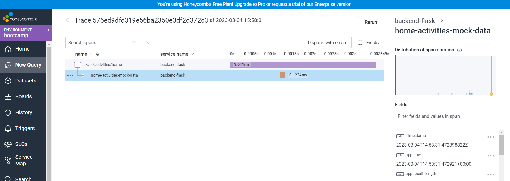

# Week 2 — Distributed Tracing
## Summery:
2. [Honeycomb.io](#honeycombio)
3. [Rollbar](#Rollbar)
4. [AWS X-Ray](#AWS-X-Ray)
5. [Cloudwatch Logs](#Cloudwatch-Logs)

## Honeycomb.io:
to set up Honeycomb there two main things that must be understood first.
* **Honeycomb** is software that lets you visualize and analyze your traces.  
* **OpenTelemetry** is an open-source project that provides instrumentation libraries for collecting metrics and traces. We will use OpenTelemetry to trace our code.  We will send our trace data, collected with OpenTelemetry, to Honeycomb.
### Create a Honeycomb envirement :


### Get the API Key for the created envirement :


### Set Gitpod enviremnt variables for Honeycomb :
```
export HONEYCOMB_API_KEY="<API-Key>"
gp env HONEYCOMB_API_KEY="<API-Key>"
export HONEYCOMB_SERVICE_NAME="Backend-flask"
gp env HONEYCOMB_SERVICE_NAME="Backend-flask"
```

### Set Honeycomb for Flask backend application:
#### Add the dependencies to the `requirements.txt` file:
```
opentelemetry-api 
opentelemetry-sdk 
opentelemetry-exporter-otlp-proto-http 
opentelemetry-instrumentation-flask 
opentelemetry-instrumentation-requests
```
#### Install the dependencies using pip:
```
pip install -r requirements.txt
```
#### Import the necessary modules into the `app.py` file:
```
from opentelemetry import trace
from opentelemetry.instrumentation.flask import FlaskInstrumentor
from opentelemetry.instrumentation.requests import RequestsInstrumentor
from opentelemetry.exporter.otlp.proto.http.trace_exporter import OTLPSpanExporter
from opentelemetry.sdk.trace import TracerProvider
from opentelemetry.sdk.trace.export import BatchSpanProcessor
```
#### Set up OpenTelemetry tracing for the Flask application and export the traces to Honeycomb. 
```
provider = TracerProvider()
processor = BatchSpanProcessor(OTLPSpanExporter())
provider.add_span_processor(processor)
trace.set_tracer_provider(provider)
tracer = trace.get_tracer(__name__)
app = Flask(__name__)
FlaskInstrumentor().instrument_app(app)
RequestsInstrumentor().instrument()
```

#### Initialize the tracing provider and span processor, and add the processor to the provider:
```
provider = TracerProvider()
processor = BatchSpanProcessor(OTLPSpanExporter())
provider.add_span_processor(processor)
```
#### Set the environment variables the docker-compose.yml file:
```
OTEL_EXPORTER_OTLP_ENDPOINT: "https://api.honeycomb.io"
OTEL_EXPORTER_OTLP_HEADERS: "x-honeycomb-team=${HONEYCOMB_API_KEY}"
OTEL_SERVICE_NAME: "${HONEYCOMB_SERVICE_NAME}"
```
### Testing Honeycomb:
1. `Docker compose up` to start the Flask backend application, and send a request to the backend server.
This will automatically create a new dataset in the Honeycomb environment with the same name as the HONEYCOMB_SERVICE_NAME environment variable value.


2. Here are the traces:


### Add a span to specific endpoint:
I added a span to the `HomeActivities` endpoint:

```
# Start a new span with a given name
with tracer.start_as_current_span("home-activities-mock-data"):
    
    # Get the current span
    span = trace.get_current_span()
    
    # Add an attribute to the span with the current timestamp
    now = datetime.now(timezone.utc).astimezone()
    span.set_attribute("app.now", now.isoformat())
```


### Run Queries in Honeycomb:
* To Count the number of http requests by http route, I added this query:


### Instrument Honeycomb for the frontend-application and calculate latency between backend and frontend:
* I faced a difficult challenge while trying to implement distributed tracing in Honeycomb for the frontend,  I spent a lot of time trying different methods, including the use of the official documentation from **Honeycomb** and **OpenTelemetry**.   
* Unfortunately, none of the instructions provided in these resources worked for me.    
* I eventually found a very useful article that provided clear and concise instructions on how to set it up The article was a game changer for me and ultimately helped me successfully implement tracing in Honeycomb for the frontend.  

Here is the reference for the article :https://blog.devgenius.io/measuring-react-performance-with-opentelemetry-and-honeycomb-2b20a7920335 

#### Understanding the approach:
* There are many ways to set up such a system. One is to send trace data to a collector and set up the collector to send data to Honeycomb. To do so, A collector must be created in a Docker container, and the other one is to use honeycomb's SDK to instrument the application code and send telemetry data to Honeycomb.
 
* I tried using the Honeycomb's SDK method but I ren into too many issues, so I had to find a different approach,So I followed a more manual approach: which is to send the trace data to a backend endpoint and then push the data to Honeycomb.


So here are the main instructions i followed:

1. Create an endpoint in the flask backend application:

```
@app.route("/api/send-trace", methods=['POST'])
@cross_origin()
def send_trace():
    try:
        # Extract trace information from request body
        trace_data_list = request.json
        tracer = trace.get_tracer(__name__)   # Get a tracer instance from the OpenTelemetry library

        # Loop through the list of spans and create a new span for each one
        for trace_data in trace_data_list:
            trace_SpanContext = trace_data.get('_SpanContext')
            duration = trace_data.get("duration")
            start_time = trace_data.get("startTime")
            end_time = trace_data.get("endTime")
            name = trace_data.get("name")
            parent_span_id = trace_data.get("parentSpanId")
            print("--------------------",parent_span_id)

            # Create a new span and set attributes
            with tracer.start_as_current_span(
                name=name,              # Set the name of the span
                context=trace_SpanContext,   # Set the context of the span
            ) as span:
                span.set_attribute("duration", duration)   # Set the duration attribute of the span
                span.set_attribute("start_time", start_time)   # Set the start time attribute of the span
                span.set_attribute("end_time", end_time)   # Set the end time attribute of the span

        # Return success response
        return ({"message": "Trace sent successfully"}), 200
    
    except Exception as e:
        # Return error response if span fails to export
        return ({"error": str(e)}), 500
```
While working on the code, I encountered some issues that needed to be addressed for optimal performance.
* I noticed that spans with the same parent trace ID were being sent separately, which resulted in incomplete traces, I managed to solve this issue by looping through the list of spans.
* I also observed that spans with the same parent span ID were being placed at the same level in the trace, making it difficult to follow the flow of the application, with some trouble shooting I found that the source of this problem comes from a miss configuration f the span parent ID. 
I believe that there is room for further optimization in the code to prevent such issues from arising in the future.

2. Instantiate the trace instrumentation in the frontend:
```
const provider = new WebTracerProvider(...);
provider.register({
  contextManager: new ZoneContextManager()
});
const fetchInstrumentation = new FetchInstrumentation({});
fetchInstrumentation.setTracerProvider(provider);
// Registering instrumentations
registerInstrumentations({
  instrumentations: [
    fetchInstrumentation,
  ],
});
export default function TraceProvider({ children }) {
  return (
    <>
      {children}
    </>
  );
}
```
3. Wrap the top level component within the TraceProvider
```
root.render(
  <React.StrictMode>
    <TraceProvider>
      <App />
    </TraceProvider>
  </React.StrictMode>
);
```
4. Create a function that reports spans to a backend server by extracting relevant information from each span and sending it as a payload using a POST request
Code here: https://github.com/anis-nouri/aws-bootcamp-cruddur-2023/blob/test/frontend-react-js/src/utilities/tracing.js

6. Create the spans , I tried creating spans In the HomeFeedData Loading function that are gonna help to calculate **latency** between the frontend and backend, So The loadData function has the following stages:
    1. Create a tracer and start a parent span.
    2. Call the backend and record the span duration.
    3. Process the data and record the span duration.
    4. End the parent span.
    5. Report the parent span along with the child spans (fetchDataSpan and processDataSpan) to the OpenTelemetry backend, I run to the issue where i couldn't set the parent span ID.
 
Code here: https://github.com/anis-nouri/aws-bootcamp-cruddur-2023/blob/test/frontend-react-js/src/pages/HomeFeedPage.js

That's all here is the result from the Honeycomb, when I go to the Home page feed:


As shown here there are 3 spans under the tace, but the loadData should have been a parent span for both fetchData , and processData, and that's because of the issue I encountered about parent-child span relationship.

I didn't wanna add this to my main branch, so I created a test branch to test this code here is the [link](https://github.com/anis-nouri/aws-bootcamp-cruddur-2023/tree/test). 

## Rollbar:


**Rollbar** is a cloud-based error tracking and monitoring tool that helps developers identify, diagnose, and debug software errors in real-time. It can be integrated into web and mobile applications, as well as other software products, to capture and report errors and exceptions that occur during runtime.

I used Rollbar to monitor and track Flask backend errors, here are the steps I followed to configure rollbar:  

1. Create a project in Rollbar:
Once the project created, an access token will be provided in the Rollbar dashboard.    
2. Add Rollbar access token the environment variables:
```
export ROLLBAR_ACCESS_TOKEN="<access-token>"
gp env ROLLBAR_ACCESS_TOKEN="<access-token>"
```
3. Install `rollbar` and  `blinker` dependencies, by adding them to `requirements.txt`
```
blinker
rollbar
```
4. Install dependencies:
 ```
pip install -r requirements.txt
```
5. Since am running my application in a container, I added rollbar access token to the `docker-compose.yml`:

```
environment:
      ROLLBAR_ACCESS_TOKEN: "${ROLLBAR_ACCESS_TOKEN}"
```
6. Import the Rollbar library inside the `app.py` and configure it with your Rollbar access token :
```
import os
import rollbar
import rollbar.contrib.flask
from flask import got_request_exception
```
```
rollbar_access_token = os.getenv('ROLLBAR_ACCESS_TOKEN')
@app.before_first_request
def init_rollbar():
    """init rollbar module"""
    rollbar.init(
        # access token
        rollbar_access_token,
        # environment name
        'production',
        # server root directory, makes tracebacks prettier
        root=os.path.dirname(os.path.realpath(__file__)),
        # flask already sets up logging
        allow_logging_basic_config=False)

    # send exceptions from `app` to rollbar, using flask's signal system.
    got_request_exception.connect(rollbar.contrib.flask.report_exception, app)

```
That's it! With these steps, the Flask backend is now set up to report errors to Rollbar. 

To test it I added an end point that will raise a warning :
```
@app.route('/rollbar/test')
def rollbar_test():
    rollbar.report_message('Hello World!', 'warning')
    return "Hello World!"
```


## AWS X-Ray:
AWS X-Ray is a service that collects data about requests that the application serves, and provides tools that to view, filter, and gain insights into that data to identify issues and opportunities for optimization.
To configure the AWS X-RAY I did the following:
### Instrument AWS X-Ray for the backend application:
#### Add `aws-xray-sdk` library in requirement.txt.
#### Install python dependencies `pip install -r requirements.txt`.
#### Add this code to app.py
```
from aws_xray_sdk.core import xray_recorder
from aws_xray_sdk.ext.flask.middleware import XRayMiddleware

xray_url = os.getenv("AWS_XRAY_URL")
xray_recorder.configure(service='Cruddur', dynamic_naming=xray_url)
XRayMiddleware(app, xray_recorder)

```
this code is for the configuration of the AWS X-Ray SDK for **Python** to trace requests for the backend Flask application and send the resulting trace data to the AWS X-Ray service for visualization and analysis.

### Set AWS X-Ray resources:
#### Create an AWS X-Ray Group:
```
aws xray create-group \
   --group-name "Cruddur" \
   --filter-expression "service(\"$FLASK_ADDRESS\")"
```

#### Create an AWS X-Ray Sampling Rule :
```
aws xray create-sampling-rule --cli-input-json file://aws/json/xray.json
```
### Add Daemon Service to Docker Compose
* In order to collect and trace data on the application's performance and behavior, it is necessary to ensure that the AWS X-Ray daemon is running and properly configured to collect data from the application. Once the daemon is operational, it will capture and transmit data to the X-Ray service, where it can be analyzed and visualized using the AWS X-Ray console.


```
 xray-daemon:
    image: "amazon/aws-xray-daemon"
    environment:
      AWS_ACCESS_KEY_ID: "${AWS_ACCESS_KEY_ID}"
      AWS_SECRET_ACCESS_KEY: "${AWS_SECRET_ACCESS_KEY}"
      AWS_REGION: "us-east-1"
    command:
      - "xray -o -b xray-daemon:2000"
    ports:
      - 2000:2000/udp
```
* Start and run the docker container:
```
Docker compose up 
```

Let's test this, to do that we can send a request to the backend server:
1. Start the backend application , using `docker compose up`.
2. Open the AWS X-Ray console.
3. Send a request to the backend server, in my case I sent an HTTP request using the `/api/activities/home` link.  


I got an error as a response, and it,s visible in the captured traces with a response code 500.  


After fixing the error in my code I can finally see the trace with a 200 response code, which is success status code that indicates that the HTTP request has been successfully processed.


### Instrumenting X-RAY Segments and Subsegments:
#### Instrumenting Segments:

**@xray_recorder.capture** is a decorator that can be applied to a function or method to capture a segment around that function's execution. It creates a custom segment in the X-Ray trace with the specified name or label and automatically starts and ends the segment around the function's execution.  
```
@xray_recorder.capture('notifications-activities')
def data_notifications():
  data = NotificationsActivities.run()
  return data, 200
```
#### Instrumenting Subsegments:
To manage subsegments, I used the begin_subsegment and end_subsegment methods.
```
subsegment = xray_recorder.begin_subsegment('mock_data')
    dict={
      "now":now.isoformat(),
      "results":len(results)
    }
    subsegment.put_metadata('key', dict, 'namespace')
    xray_recorder.end_subsegment()
```
Here is the trace with the segment and subsegment in AWS X-RAY:


## CloudWatch Logs

CloudWatch Logs is a log management service built into AWS, to be able to use it with our Flask backend application watchtower is required.  
Watchtower, is a lightweight adapter between the Python logging system and CloudWatch Logs. It uses the boto3 AWS SDK.  
To configure cloud watch I did the following:


1. Add `watchtower` to the Flask backend `requirements.txt`.  

3. Install dependencies:
```
pip install -r requirements.txt
```

3. Import the necessary modules inside `app.py`:
```
import watchtower
import logging
from time import strftime
```

4. Configure the logger:
```
# Configuring Logger to Use CloudWatch
LOGGER = logging.getLogger(__name__)
LOGGER.setLevel(logging.DEBUG)
console_handler = logging.StreamHandler()
cw_handler = watchtower.CloudWatchLogHandler(log_group='cruddur')
LOGGER.addHandler(console_handler)
LOGGER.addHandler(cw_handler)
LOGGER.info("some message")
```

5. Define an `after_request` function to log details about each request made to the API endpoint:
```
@app.after_request
def after_request(response):
    timestamp = strftime('[%Y-%b-%d %H:%M]')
    LOGGER.error('%s %s %s %s %s %s', timestamp, request.remote_addr, request.method, request.scheme, request.full_path, response.status)
    return response
```

6. Log a message in the API endpoint:
```
LOGGER.info('Hello Cloudwatch! from  /api/activities/home')
```

5. Set the environment variables in the backend-flask for docker-compose.yml

```
      AWS_DEFAULT_REGION: "${AWS_DEFAULT_REGION}"
      AWS_ACCESS_KEY_ID: "${AWS_ACCESS_KEY_ID}"
      AWS_SECRET_ACCESS_KEY: "${AWS_SECRET_ACCESS_KEY}"
```


