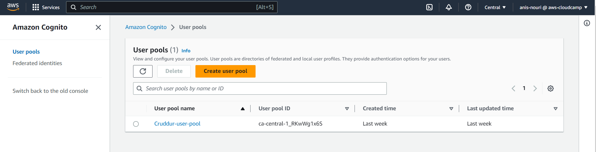
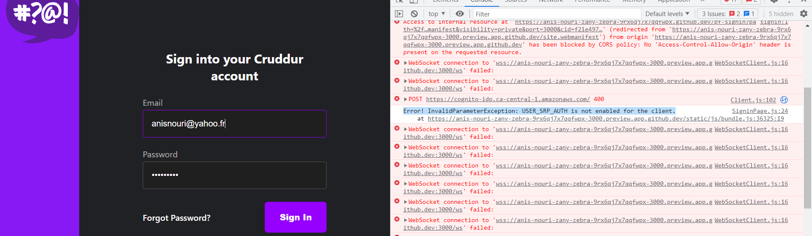
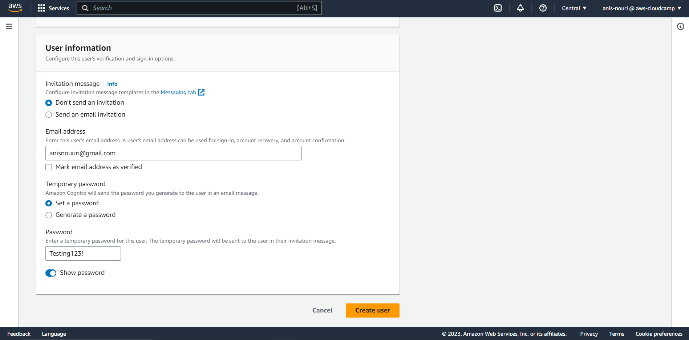
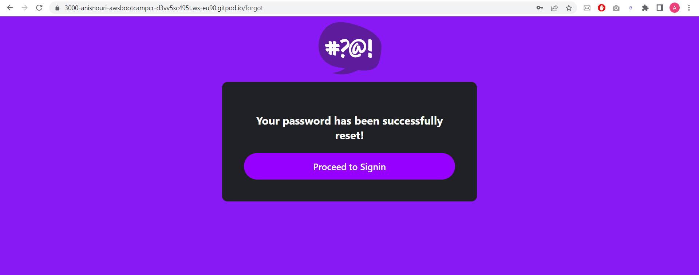
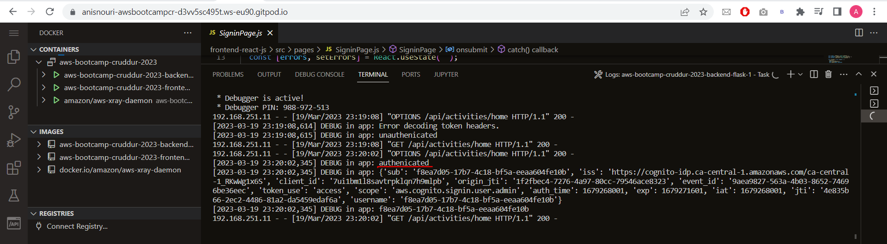
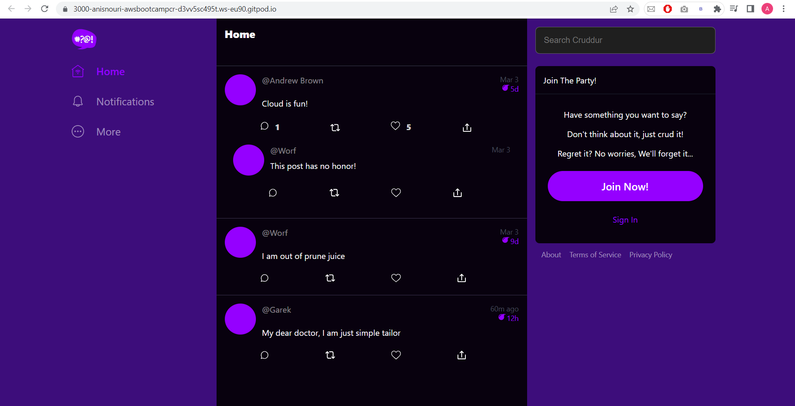

# Week 3 — Decentralized Authentication
## Set up Cognito User Pool:
* I used the AWS Console to create a Cognito User Group:


* I ran into an issue that said 'enable USER_SRP_AUTH for the client'. To solve that issue without recreating a new User Group, I followed these steps.


1. Go to the AWS Cognito console.
2. Select your user pool.
3. Click on **App Integration** > **App Client List** tab.
4. Select the app client you are using.
5. Under the **App client information** click on **Edit**.
6. Scroll down to the **Auth Flows Configuration** section, Check the **ALLOW_USER_SRP_AUTH** option
7. Click "Save changes".

## AWS Amplify:
AWS Amplify is a popular framework that makes it easier to integrate AWS services, AWS Cognito including Amazon Cognito, into the frontend application.
To configure AWS Amplify in the frontend application I did the following:
### Install AWS Amplify :
```
npm i aws-amplify --save
```
### Configure AWS Amplify:
```
import { Amplify } from 'aws-amplify';

Amplify.configure({
  "AWS_PROJECT_REGION": process.env.REACT_AWS_PROJECT_REGION,
  "aws_cognito_identity_pool_id": process.env.REACT_APP_AWS_COGNITO_IDENTITY_POOL_ID,
  "aws_cognito_region": process.env.REACT_APP_AWS_COGNITO_REGION,
  "aws_user_pools_id": process.env.REACT_APP_AWS_USER_POOLS_ID,
  "aws_user_pools_web_client_id": process.env.REACT_APP_CLIENT_ID,
  "oauth": {},
  Auth: {
    // We are not using an Identity Pool
    // identityPoolId: process.env.REACT_APP_IDENTITY_POOL_ID, // REQUIRED - Amazon Cognito Identity Pool ID
    region: process.env.REACT_AWS_PROJECT_REGION,           // REQUIRED - Amazon Cognito Region
    userPoolId: process.env.REACT_APP_AWS_USER_POOLS_ID,         // OPTIONAL - Amazon Cognito User Pool ID
    userPoolWebClientId: process.env.REACT_APP_AWS_USER_POOLS_WEB_CLIENT_ID,   // OPTIONAL - Amazon Cognito Web Client ID (26-char alphanumeric string)
  }
});
```
#### Add envirement variables to docker-compose.yml
```
REACT_APP_AWS_PROJECT_REGION: "${AWS_DEFAULT_REGION}"
REACT_APP_AWS_COGNITO_REGION: "${AWS_DEFAULT_REGION}"
REACT_APP_AWS_USER_POOLS_ID: "ca-central-1_RKwWg1x6S"
REACT_APP_CLIENT_ID: "7ui1bm1l8savtrpklqn7h9mlpb"
```

## Implement Custom Sign-In Page:
### Create a user using AWS Console Mangement:


### Verifying the user:
```
aws cognito-idp admin-set-user-password \
  --user-pool-id <your-user-pool-id> \
  --username <username> \
  --password <password> \
  --permanent
```
### Updated SigninPage.js:
* This **onsubmit** function calls `the Auth.signIn` method to sign in the user. If the user is successfully signed in, their access token is stored in local storage and they are redirected to the homepage. If an error occurs during sign-in, it is handled appropriately, either by redirecting the user to a confirmation page or setting the errors state to the error message.

```
import { Auth } from 'aws-amplify';

const onsubmit = async (event) => {
  setErrors('')
  event.preventDefault();
  Auth.signIn(email, password)
  .then(user => {
    localStorage.setItem("access_token", user.signInUserSession.accessToken.jwtToken)
    window.location.href = "/"
  })
  .catch(error => {
    if (error.code == 'UserNotConfirmedException') {
      window.location.href = "/confirm"
    }
    setErrors(error.message)
  });
  return false
}
```

## Implement Custom Sign-Up Page:
### Updated SignupPage.js:
* The **onsubmit** function creates a new user account using the `Auth.signUp` method provided by the AWS Amplify library. If the sign-up is successful, it redirects the user to the email confirmation page. If it fails, it displays an error message to the user.

```
  const onsubmit = async (event) => {
    setErrors('')
    event.preventDefault();
    Auth.signIn(email, password)
    .then(user => {
      console.log('user',user)
      localStorage.setItem("access_token", user.signInUserSession.accessToken.jwtToken)
      window.location.href = "/"
    })
    .catch(error => { 
      if (error.code == 'UserNotConfirmedException') {
        window.location.href = "/confirm"
      }
      setErrors(error.message)
    });
    return false
  }
```
## Implement Custom Confirmation Page:
### Updated ConfirmationPage.js:
* The **resend_code** function resends an activation code for a user's email address using the `Auth.resendSignUp` method. It logs success or error messages to the console and updates state variables setErrors and setCodeSent accordingly.

```
const resend_code = async (event) => {
  setErrors('');
  try {
    await Auth.resendSignUp(email);
    console.log('Code resent successfully');
    setCodeSent(true);
  } catch (err) {
    console.log(err);
    if (err.message === 'Username cannot be empty') {
      setErrors('You need to provide an email in order to send Resend Activation Code.');
    } else if (err.message === 'Username/client id combination not found.') {
      setErrors('Email is invalid or cannot be found.');
    }
  }
};
```

* the **onsubmit** function confirms the sign-up of a user by calling the `Auth.confirmSignUp` method with the email and code parameters. If successful, the user is redirected to the home page, otherwise, any error messages are stored in the setErrors state variable. The function returns false to prevent the form submission behavior.
```
const onsubmit = async (event) => {
  event.preventDefault();
  setErrors('');
  try {
    await Auth.confirmSignUp(email, code);
    window.location.href = '/';
  } catch (error) {
    setErrors(error.message);
  }
  return false;
};
```
#### fixing the email autocomplete:
* The useLocation hook is provided by the react-router-dom library and is used to access the current location object of the React Router. It returns an object that contains information about the current URL path, search query, and other location-related data.
```
import { useLocation } from 'react-router-dom';
const location = useLocation();
  React.useEffect(() => {
    const searchParams = new URLSearchParams(location.search);
    const emailParam = searchParams.get('email');
    if (emailParam) {
      setEmail(emailParam);
    }
  }, [location]);
```

## Implement Custom Recovery Page:
### Updated RecoveryPage.js:
* The **onsubmit_send_code** function initiates the forgot password flow by calling the `Auth.forgotPassword` method with the username parameter. If successful, it updates the form state to prompt the user for the confirmation code. If there is an error, it stores the error message in the setErrors state variable. The function returns false to prevent the default form submission behavior.
```
  const onsubmit_send_code = async (event) => {
    event.preventDefault();
    setErrors('')
    Auth.forgotPassword(username)
    .then((data) => setFormState('confirm_code') )
    .catch((err) => setErrors(err.message) );
    return false
  }
```

* The **onsubmit_confirm_code** function submits the confirmation code entered by the user along with the new password to reset a forgotten password using the `Auth.forgotPasswordSubmit` method. If the passwords match, the function updates the form state to 'success' upon successful submission, and if there is an error, the function stores the error message in the setErrors state variable. The function returns false to prevent the default form submission behavior.

```
const onsubmit_confirm_code = async (event) => {
  event.preventDefault();
  setErrors('');
  if (password === passwordAgain) {
    Auth.forgotPasswordSubmit(username, code, password)
      .then((data) => setFormState('success'))
      .catch((err) => setErrors(err.message));
  } else {
    setErrors('Passwords do not match');
  }
  return false;
};
```
### Improve UI for successfull password recovery:


## Implement Token verification in the Flask backend:



## Improve UI Contrast and Implementing CSS Variables For Themeing:
To improve the frontend contrast, I used variables this helps to avoid redundancy and makes it easier to update styles consistently.
This is an example of how variables are used in this project:  
*  I created a variable named bg for the background color.
```
:root {
  --bg: rgb(61,13,123);
  --fg: rgb(8,1,14);
  --field-border: rgba(255,255,255,0.29); 
  --field-bg: rgba(31,31,31);
  --field-border-focus: rgba(149,0,255,0.1);
}
}
```
* To use the variable, I referenced it using the `var()` function. 
```
html,body { 
  background: var(--bg);
}
```


